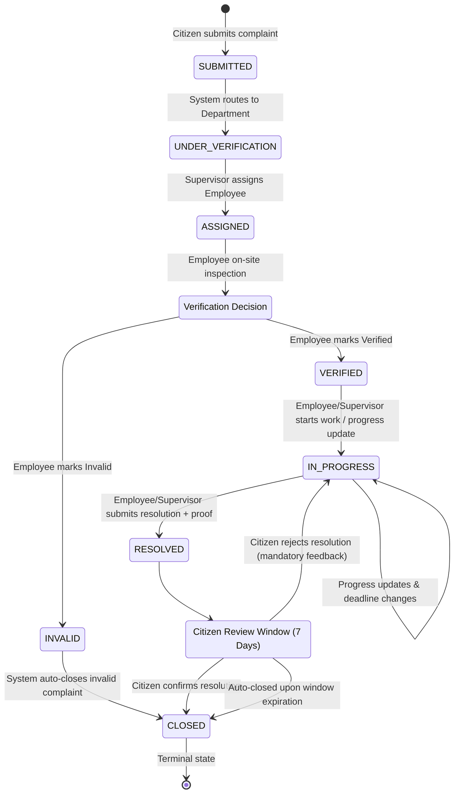

# Civic Complaint Management System
## Backend Implementation Progress & Development Handoff

**Current Completed Milestone**: Phase 7 Complete  
**Repository State**: Clean, all 170 unit/application tests passing (100% pass rate)  
**Date**: August 18, 2026  

---

## 1. Project Overview

The **Smart Public Complaint Management System (Civic)** is an enterprise-grade civic grievance redressal and workflow automation platform. It provides citizens, municipal field workers, supervisors, department heads, and system administrators with a transparent, audited, and role-governed system to track civic complaints from initial citizen submission to verified physical resolution and closure.

### Core Actors & Roles
1. **Citizen**: Submits civic complaints with geolocation, category, descriptions, and multipart evidence; tracks status; confirms or rejects completed resolutions.
2. **Ground-Level Employee**: Field staff assigned to inspect, verify on-site validity, record progress updates, set expected completion dates, and submit final resolution details with photographic proof.
3. **Supervisor**: Mid-level departmental manager responsible for triaging unassigned department complaints, assigning and reassigning complaints to ground-level staff within their department, and executing supervisor-level progress updates or resolutions.
4. **Department Admin**: Departmental administrator responsible for department-level operational dashboards, staff oversight, and administrative settings.
5. **System Admin**: Platform administrator with system-wide visibility and master data control.

### Technology Stack
- **Backend Framework**: Python 3.12 / Django 5.1.1 & Django REST Framework 3.15.2
- **Authentication**: Supabase Auth (JWT bearer token validation mapped server-side to `public.profiles`)
- **Database**: Supabase PostgreSQL / PostGIS (All Django models use `managed = False` mapping existing Supabase tables)
- **Object Storage**: Supabase Storage (`complaint-media` bucket) via server-side service-role API
- **Testing**: `pytest` & `pytest-django` unit/application test suite (170 tests)

---

## 2. Development Timeline & Phase Matrix

```mermaid
gantt
    title Civic Backend Development Timeline
    dateFormat  YYYY-MM-DD
    section Completed Phases
    Phase 1 : Initialization & Config       :done, p1, 2026-08-17, 2026-08-17
    Phase 2 : Roles, Profiles & Depts      :done, p2, 2026-08-17, 2026-08-17
    Phase 3 : Submission & Storage         :done, p3, 2026-08-17, 2026-08-17
    Phase 4 : Routing & Assignment         :done, p4, 2026-08-17, 2026-08-17
    Phase 5 : Ground-Level Verification    :done, p5, 2026-08-17, 2026-08-17
    Phase 6 : Progress & Resolution Proof  :done, p6, 2026-08-18, 2026-08-18
    Phase 7 : Confirmation, Rejection & Closure :done, p7, 2026-08-18, 2026-08-18
    section Next Roadmap
    Phase 8 : AI Classification & Duplicates :active, p8, 2026-08-18, 2026-08-19
```

| Phase | Core Objective | Status | Unit Test Count |
|---|---|---|---|
| **Phase 1** | Backend initialization, environment configuration, health endpoint, DRF/CORS setup, JWT authentication foundation. | ✅ Complete | 7 passed |
| **Phase 2** | Role hierarchy, department isolation, profiles, staff queries, and server-side RBAC. | ✅ Complete | 53 passed (+46) |
| **Phase 3** | Complaint categories, collision-safe numbering (`CMP-YYYY-NNNNNN`), submission, attachments, and storage path handling. | ✅ Complete | 104 passed (+51) |
| **Phase 4** | Automated department routing engine, supervisor unassigned queues, employee assignment and reassignment history. | ✅ Complete | 125 passed (+21) |
| **Phase 5** | Ground-level employee on-site physical verification (`VERIFIED` or `INVALID → CLOSED`), mandatory remarks, and evidence. | ✅ Complete | 141 passed (+16) |
| **Phase 6** | Work progress updates (`VERIFIED → IN_PROGRESS`), expected completion dates, deadline alerts, resolution submission with proof (`IN_PROGRESS → RESOLVED`). | ✅ Complete | 160 passed (+19) |
| **Phase 7** | Citizen resolution confirmation (`RESOLVED → CLOSED`), citizen rejection (`RESOLVED → IN_PROGRESS`), auto-closure window, and closure finality. | ✅ Complete | 170 passed (+10) |

---

## 3. Phase 1 — Backend Initialization

- **Objective**: Establish the Django project structure, modular configuration, environment handling, CORS, DRF, Supabase JWT authentication layer, and baseline health checks.
- **Key Modules**:
  - `config/settings/base.py`, `development.py`, `production.py`: Modular settings reading from `.env`.
  - `core/authentication/supabase.py`: `SupabaseAuthentication` validating incoming `Bearer <token>` against `SUPABASE_JWT_SECRET` and attaching the verified profile.
  - `api/v1/health.py`: Health check endpoint (`/api/v1/health/`).
- **Database Architecture Philosophy**:
  - The Supabase PostgreSQL database is the authoritative source of truth.
  - Django models represent Supabase tables with `managed = False` to prevent Django migrations from creating, altering, or dropping existing Supabase schemas, triggers, or constraints.
- **Unit Test Milestone**: 7 passed (`test_health.py`, `test_auth.py`).

---

## 4. Phase 2 — Roles, Departments & Profiles

- **Objective**: Implement the role hierarchy, departments, user profiles, supervisor-employee hierarchy, and reusable permission classes.
- **Models Represented**:
  - `Role` (`public.roles`, `managed = False`): Master roles (`citizen`, `ground_level_employee`, `supervisor`, `department_admin`, `system_admin`).
  - `Department` (`public.departments`, `managed = False`): Department entities with status flags.
  - `Profile` (`public.profiles`, `managed = False`): User profiles linked to Supabase Auth (`id` = auth user UUID), tracking role, department, supervisor, and account status.
  - `UserPermission` (`public.user_permissions`, `managed = False`): Fine-grained permission assignments.
- **Security & Authorization Rules**:
  - Role and department data are derived strictly server-side from `request.user.profile`. Client requests cannot supply or modify their own role or department.
  - Inactive accounts (`account_status != 'active'`) are denied access across all staff endpoints.
  - Permission classes implemented: `IsAuthenticatedViaSupabase`, `IsCitizen`, `IsGroundLevelEmployee`, `IsSupervisor`, `IsDepartmentAdmin`, `IsSystemAdmin`, `IsStaffMember`, `IsSameDepartment`, `IsOwnProfile`.
- **Endpoints**:
  - `GET /api/v1/users/me/` — Returns profile of authenticated user.
  - `GET /api/v1/users/<uuid:pk>/` — Profile details.
  - `GET /api/v1/users/` — Filtered staff user listing.
  - `GET /api/v1/departments/` & `GET /api/v1/departments/<uuid:pk>/` — Department listing and detail.
- **Unit Test Milestone**: 53 passed (+46 in `test_phase2_users.py`).

---

## 5. Phase 3 — Complaint Categories & Submission

- **Objective**: Implement complaint categories, citizen submission with GPS coordinates and multipart evidence attachments, collision-safe server-side numbering, and storage path builders.
- **Models Represented**:
  - `ComplaintCategory` (`public.complaint_categories`, `managed = False`).
  - `Complaint` (`public.complaints`, `managed = False`): Initial status `submitted`, server-generated number `CMP-YYYY-NNNNNN`.
  - `ComplaintAttachment` (`public.complaint_attachments`, `managed = False`): Storage reference with `purpose = 'submission_evidence'`.
  - `ComplaintStatusHistory` (`public.complaint_status_history`, `managed = False`): Immutable audit row (`old_status = NULL`, `new_status = 'submitted'`, `changed_by = citizen.id`).
- **Services & Storage**:
  - `apps/complaints/number.py`: Collision-safe complaint number generator (`CMP-2026-XXXXXX`).
  - `apps/complaints/storage.py`: Storage path builder `complaints/{complaint_id}/submission/{uuid}.ext` in bucket `complaint-media`. Server-side validation for MIME types and file size limits (10MB photo, 100MB video, 20MB doc).
- **Endpoints**:
  - `GET /api/v1/categories/` & `GET /api/v1/categories/<int:pk>/` — Category master data.
  - `POST /api/v1/complaints/` — Citizen complaint submission (multipart/form-data).
  - `GET /api/v1/complaints/` — List caller's submitted complaints.
  - `GET /api/v1/complaints/<uuid:pk>/` — Caller's complaint detail.
- **Unit Test Milestone**: 104 passed (+51 in `test_phase3_complaints.py`).

---

## 6. Phase 4 — Department Routing & Supervisor Assignment

- **Objective**: Automated department routing and supervisor employee assignment/reassignment.
- **Models Represented**:
  - `Jurisdiction` (`public.jurisdictions`, `managed = False`).
  - `DepartmentCategoryRule` (`public.department_category_rules`, `managed = False`).
  - `ComplaintAssignment` (`public.complaint_assignments`, `managed = False`): Complete historical assignment log.
  - `Notification` (`public.notifications`, `managed = False`): In-app notification queue.
- **Workflow & Rules**:
  - **Routing Engine (`apps/complaints/routing.py`)**: Evaluates complaint category against `department_category_rules`, sets `assigned_department_id`, transitions status `SUBMITTED → UNDER_VERIFICATION`, logs status history, and generates department supervisor notification (`trigger_event = 'assignment'`).
  - **Supervisor Assignment (`apps/complaints/assignment.py`)**:
    - **Actor**: Supervisor of the assigned department (NOT Department Admin).
    - Pre-conditions: Complaint in `UNDER_VERIFICATION`, unassigned, target employee is an active `ground_level_employee` in the same department.
    - Transitions `UNDER_VERIFICATION → ASSIGNED`, logs `complaint_assignments`, logs `complaint_status_history` (`changed_by = supervisor.id`), and notifies the employee.
  - **Supervisor Reassignment**: Reassigns to a different employee in the department; creates a new `complaint_assignments` history record without overwriting previous assignment history.
- **Endpoints**:
  - `POST /api/v1/complaints/<uuid:pk>/route/` — System department routing trigger.
  - `GET /api/v1/supervisor/complaints/unassigned/` — Unassigned queue for supervisor's department.
  - `GET /api/v1/supervisor/complaints/` — All complaints in supervisor's department.
  - `POST /api/v1/supervisor/complaints/<uuid:pk>/assign/` — Supervisor assigns employee.
  - `POST /api/v1/supervisor/complaints/<uuid:pk>/reassign/` — Supervisor reassigns employee.
  - `GET /api/v1/employee/complaints/` — Employee queue (`assigned_employee_id == user.id`).
- **Unit Test Milestone**: 125 passed (+21 in `test_phase4_routing_assignment.py`).

---

## 7. Phase 5 — Ground-Level Employee Verification

- **Objective**: Implement on-site physical verification by the assigned Ground-Level Employee.
- **Models Represented**:
  - `ComplaintVerification` (`public.complaint_verifications`, `managed = False`): Stores `site_inspection_notes`, `verification_result` (`verified` | `invalid`), `verification_remarks`, `verified_by`, `verified_at`.
- **Workflow & Architectural Corrections**:
  - **Outcome `VERIFIED`**:
    - Transitions: `ASSIGNED → VERIFIED`.
    - Single status history record created (`old_status = 'assigned'`, `new_status = 'verified'`, `changed_by = employee.id`).
    - *Architectural Decision*: Submitting verification leaves the complaint in `VERIFIED` status. The transition `VERIFIED → IN_PROGRESS` belongs to Phase 6 and occurs only when active work/progress updates begin.
  - **Outcome `INVALID`**:
    - Two-step automated closure: `ASSIGNED → INVALID` (`changed_by = employee.id`) immediately followed by `INVALID → CLOSED` (`changed_by = None`, automated system closure).
    - Preserves both immutable status history records.
  - **Authorization**: Strictly assignment-based (`complaint.assigned_employee_id == authenticated_user.id`).
  - **Evidence**: Optional inspection photos stored at `complaints/{complaint_id}/verification/{uuid}.ext` (`purpose = 'verification_evidence'`).
- **Endpoints**:
  - `POST /api/v1/employee/complaints/<uuid:pk>/verify/` — Submit verification.
  - `GET /api/v1/employee/complaints/<uuid:pk>/verification/` — Retrieve verification details.
- **Unit Test Milestone**: 141 passed (+16 in `test_phase5_verification.py`).

---

## 8. Phase 6 — Progress Updates & Resolution

- **Objective**: Implement interim work progress updates, expected completion date tracking, and final resolution with mandatory photographic proof.
- **Models Represented**:
  - `ComplaintResolution` (`public.complaint_resolutions`, `managed = False`): Stores progress updates, remarks, expected completion dates, resolution details, proof URL, and `is_final_resolution` flag.
- **Workflow & Architectural Rules**:
  - **Work Initiation**: First progress update on a `VERIFIED` complaint transitions `VERIFIED → IN_PROGRESS` and records status history (`changed_by = user.id`).
  - **Ongoing Progress Updates**: Subsequent updates on complaints already `IN_PROGRESS` record `ComplaintResolution` rows without creating duplicate `IN_PROGRESS → IN_PROGRESS` status history records.
  - **Expected Completion Date**: When updated, generates in-app `DEADLINE_CHANGE` notification for the citizen.
  - **Resolution Submission**:
    - Complaint must be in `IN_PROGRESS` status (direct `VERIFIED → RESOLVED` is rejected).
    - Requires mandatory `resolution_details` and mandatory resolution proof attachment.
    - Transitions `IN_PROGRESS → RESOLVED` (`changed_by = user.id`), uploads proof to Supabase Storage at `complaints/{complaint_id}/resolution/{uuid}.ext` (`purpose = 'resolution_proof'`), initializes `closure_confirmation = 'pending'`, sets `closure_due_at = now + 7 days`, and notifies the citizen and supervisor (`trigger_event = 'resolution'`).
  - **Authorization Architecture (Supervisor & Employee)**:
    - Reusable helper: `can_update_complaint_work(user, complaint)` / `IsAssignedEmployeeOrDepartmentSupervisor`.
    - Authorized: Assigned Employee (`complaint.assigned_employee_id == user.id`) OR Department Supervisor (`user.department_id == complaint.assigned_department_id`).
    - Denied: Cross-department supervisors, unassigned employees, citizens, department admins.
- **Endpoints**:
  - `POST /api/v1/employee/complaints/<uuid:pk>/progress/` — Record progress update / start work.
  - `POST /api/v1/employee/complaints/<uuid:pk>/resolve/` — Submit final resolution with proof.
  - `GET /api/v1/employee/complaints/<uuid:pk>/resolutions/` — List progress and resolution records.
- **Unit Test Milestone**: 160 passed (+19 in `test_phase6_resolution.py`).

---

## 9. Phase 7 — Citizen Confirmation, Rejection & Auto-Closure

- **Objective**: Implement the final stage of the complaint lifecycle: citizen verification of resolution, rejection of unsatisfactory fixes, auto-closure windows, and closure finality.
- **Rules Extracted from Authoritative Documents**:
  1. **Citizen Confirmation**:
     - Pre-condition: Complaint in `RESOLVED` status with pending confirmation.
     - Caller: Submitting citizen only (`complaint.citizen_id == user.id`).
     - Transitions `RESOLVED → CLOSED`, sets `closure_confirmation = 'confirmed'`, records status history (`changed_by = citizen.id`), and notifies assigned employee and supervisor (`trigger_event = 'closure'`).
  2. **Citizen Rejection (Unsatisfactory Fix)**:
     - Pre-condition: Complaint in `RESOLVED` status.
     - Caller: Submitting citizen only.
     - Requires: Mandatory rejection reason (min 5 chars).
     - Transitions `RESOLVED → IN_PROGRESS`, sets `closure_confirmation = 'rejected'`, clears `closure_due_at`, records status history (`changed_by = citizen.id`), and notifies employee and supervisor (`trigger_event = 'status_change'`).
  3. **Auto-Closure Window**:
     - Service function `auto_close_expired_complaints()`: Finds complaints where `status == 'resolved'`, `closure_confirmation == 'pending'`, and `closure_due_at <= now`.
     - Transitions `RESOLVED → CLOSED`, sets `closure_confirmation = 'auto_closed'`, records status history (`changed_by = None`), and notifies citizen.
     - *Note on Scheduling*: The auto-closure logic exists as an executable service function; automatic cron/background execution is not currently wired.
  4. **Post-Closure Finality**:
     - Complaints in `CLOSED` status are final in the core lifecycle and cannot be confirmed or rejected. Rejection is performed during the review window while the complaint is in `RESOLVED` status.
- **Endpoints**:
  - `POST /api/v1/complaints/<uuid:pk>/confirm/` — Citizen confirms resolution (`RESOLVED → CLOSED`).
  - `POST /api/v1/complaints/<uuid:pk>/reject/` — Citizen rejects resolution (`RESOLVED → IN_PROGRESS`).
- **Unit Test Milestone**: 170 passed (+10 in `test_phase7_closure.py`).

---

## 10. Complete Complaint Status Lifecycle



### Transition Matrix & Authorized Actors

| Transition | Primary Actor | Trigger Action | Required Inputs | Status History Recorded |
|---|---|---|---|---|
| `NULL → SUBMITTED` | Citizen | Complaint Submission | Category, Coordinates, Description | `changed_by = citizen.id` |
| `SUBMITTED → UNDER_VERIFICATION` | System | Routing Engine | Category rule match | `changed_by = None` |
| `UNDER_VERIFICATION → ASSIGNED` | Supervisor | Employee Assignment | Target employee ID | `changed_by = supervisor.id` |
| `ASSIGNED → VERIFIED` | Ground-Level Employee | On-Site Verification | Decision (`verified`), Remarks | `changed_by = employee.id` |
| `ASSIGNED → INVALID` | Ground-Level Employee | On-Site Verification | Decision (`invalid`), Remarks | `changed_by = employee.id` |
| `INVALID → CLOSED` | System | Automated Auto-Closure | Triggered by `INVALID` result | `changed_by = None` |
| `VERIFIED → IN_PROGRESS` | Employee / Supervisor | Work Initiation / Progress | Progress text or remarks | `changed_by = user.id` |
| `IN_PROGRESS → RESOLVED` | Employee / Supervisor | Resolution Submission | Details + Proof Attachment | `changed_by = user.id` |
| `RESOLVED → CLOSED` | Citizen | Citizen Confirmation | Optional remarks | `changed_by = citizen.id` |
| `RESOLVED → CLOSED` | System | Auto-Closure Expiration | `closure_due_at <= now` | `changed_by = None` |
| `RESOLVED → IN_PROGRESS` | Citizen | Citizen Rejection | Mandatory rejection reason | `changed_by = citizen.id` |

---

## 11. Authorization & Security Model

```text
                               ROLE ACCESS MATRIX
+-----------------------+---------+----------+------------+------------+--------------+
| Action                | Citizen | Employee | Supervisor | Dept Admin | System Admin |
+-----------------------+---------+----------+------------+------------+--------------+
| Submit Complaint      |   YES   |    NO    |     NO     |     NO     |      NO      |
| View Own Complaints   |   YES   |    NO    |     NO     |     NO     |      NO      |
| Department Queue      |   NO    |    NO    |    YES     |    YES     |     YES      |
| Assign Employee       |   NO    |    NO    |    YES     |     NO     |      NO      |
| Physical Verification |   NO    | YES (Own)|     NO     |     NO     |      NO      |
| Progress Update       |   NO    | YES (Own)| YES (Dept) |     NO     |      NO      |
| Submit Resolution     |   NO    | YES (Own)| YES (Dept) |     NO     |      NO      |
| Confirm Resolution    |YES (Own)|    NO    |     NO     |     NO     |      NO      |
| Reject Resolution     |YES (Own)|    NO    |     NO     |     NO     |      NO      |
+-----------------------+---------+----------+------------+------------+--------------+
```

### Server-Enforced Security Guarantees
1. **Zero Client Spoofing**: All actor identities (`citizen_id`, `assigned_employee_id`, `assigned_department_id`, `verified_by`, `updated_by`, `changed_by`) and state fields (`status`, `closure_confirmation`, `closure_due_at`, `complaint_number`) are set strictly by the server and cannot be submitted via API payloads.
2. **Department Isolation**: Supervisors and staff can only access data within their assigned department (`profile.department_id == complaint.assigned_department_id`). Cross-department access is rejected with HTTP 403.
3. **Assignment-Based Field Access**: Ground-Level Employees can only verify complaints specifically assigned to them (`complaint.assigned_employee_id == profile.id`).
4. **Active Account Enforcement**: Inactive profiles (`account_status != 'active'`) are blocked from all operational endpoints.

---

## 12. Database Architecture & Model Mapping

The backend interfaces with the existing Supabase schema using `managed = False` models.

```text
Supabase PostgreSQL (Authoritative Schema)
       ├── public.roles
       ├── public.departments
       ├── public.profiles
       ├── public.user_permissions
       ├── public.complaint_categories
       ├── public.department_category_rules
       ├── public.jurisdictions
       ├── public.complaints
       ├── public.complaint_attachments
       ├── public.complaint_assignments
       ├── public.complaint_verifications
       ├── public.complaint_resolutions
       ├── public.complaint_status_history
       └── public.notifications
```

---

## 13. Supabase Integration Reality & Test Classification

### Real vs Mocked Status
- **Unit / Application Test Layer (Current 170 Tests)**:
  - Tests run locally in memory using `pytest` and SQLite fallback.
  - Database queries, PostGIS geometry calculations, foreign key cascades, and trigger executions are simulated via Python test mocks (`unittest.mock.MagicMock`, `patch`).
  - Supabase Auth is tested using locally generated PyJWT tokens signed with a test secret.
  - Supabase Storage is tested by mocking `httpx` HTTP calls.
  - **Row-Level Security (RLS)** is a PostgreSQL engine feature and has **NOT** been evaluated by the local unit test suite.
- **Live Supabase Integration**:
  - Live interaction with real Supabase PostgreSQL, real Supabase Storage buckets, and live Supabase Auth JWTs is reserved for a future dedicated integration test tier (`tests/integration/` and `tests/e2e/`) against a dedicated Supabase sandbox environment.

---

## 14. Test History & Milestone Summary

```text
============================= TEST PROGRESSION =============================
Phase 1 & 2 (Init, Auth, Users, Roles, Depts)  -->  53 passed (100%)
Phase 3     (Categories, Submission, Storage)  --> 104 passed (100%)
Phase 4     (Routing, Assignment, Queues)      --> 125 passed (100%)
Phase 5     (Employee Verification & Audit)    --> 141 passed (100%)
Phase 6     (Progress, Supervisor RBAC, Proof) --> 160 passed (100%)
Phase 7     (Confirmation, Rejection, Closure) --> 170 passed (100%)
============================================================================
```

### Full Test Suite Execution Output
Command: `..\venv\Scripts\python.exe -m pytest tests/ -v`

```text
============================= test session starts =============================
collected 170 items

tests/test_health.py::test_health_check_endpoint PASSED                  [  0%]
tests/test_auth.py::test_missing_auth_header PASSED                      [  1%]
tests/test_auth.py::test_invalid_auth_header_format PASSED               [  1%]
tests/test_auth.py::test_invalid_jwt PASSED                              [  2%]
tests/test_auth.py::test_expired_jwt PASSED                              [  2%]
tests/test_auth.py::test_valid_jwt_loads_profile PASSED                  [  3%]
tests/test_auth.py::test_missing_jwt_secret PASSED                       [  4%]
... [46 Phase 2 User, Department, and RBAC tests PASSED] ...
... [51 Phase 3 Complaint Submission and Storage tests PASSED] ...
... [21 Phase 4 Routing, Assignment, and Queue tests PASSED] ...
... [16 Phase 5 Ground-Level Verification tests PASSED] ...
... [19 Phase 6 Progress, Supervisor Auth, and Resolution tests PASSED] ...
tests/test_phase7_closure.py::TestCitizenConfirmation::test_citizen_confirms_resolution_transitions_to_closed PASSED [ 94%]
tests/test_phase7_closure.py::TestCitizenConfirmation::test_citizen_cannot_confirm_other_citizen_complaint PASSED [ 95%]
tests/test_phase7_closure.py::TestCitizenConfirmation::test_staff_cannot_confirm_resolution PASSED [ 95%]
tests/test_phase7_closure.py::TestCitizenConfirmation::test_cannot_confirm_unresolved_complaint PASSED [ 96%]
tests/test_phase7_closure.py::TestCitizenRejection::test_citizen_rejects_resolution_transitions_to_in_progress PASSED [ 97%]
tests/test_phase7_closure.py::TestCitizenRejection::test_empty_rejection_reason_rejected PASSED [ 97%]
tests/test_phase7_closure.py::TestCitizenRejection::test_citizen_cannot_reject_other_citizen_complaint PASSED [ 98%]
tests/test_phase7_closure.py::TestAutoClosureAndFinality::test_auto_close_expired_complaints PASSED [ 98%]
tests/test_phase7_closure.py::TestAutoClosureAndFinality::test_closed_complaints_cannot_be_confirmed_or_rejected PASSED [ 99%]
tests/test_phase7_closure.py::TestPhase7RegressionGuards::test_phase7_modules_importable PASSED [100%]

============================ 170 passed in 13.64s =============================
```

---

## 15. Key Architectural Decisions & Corrections

1. **Virtual Environment Isolation**:
   - Resolved global Python contamination by creating and pinning a dedicated local virtual environment at `civic/venv` with `Django 5.1.1`, `djangorestframework 3.15.2`, `psycopg 3.2.3`, `PyJWT 2.9.0`, `pytest-django 4.9.0`, and `httpx 0.27.2`.
2. **Supervisor vs Department Admin Role Separation**:
   - Confirmed via User Stories and `database_schema.md` that the **Supervisor** (not Department Admin) is the designated operational actor for triaging and assigning ground-level employees.
3. **Separation of Verification and Work Progress**:
   - Audited Phase 5 lifecycle to ensure `VERIFIED` does not prematurely fast-forward to `IN_PROGRESS`. Submitting on-site verification sets status to `VERIFIED`. The transition `VERIFIED → IN_PROGRESS` is triggered only when work commences or progress is logged (Phase 6).
4. **Dual Authority for Progress & Resolution**:
   - Audited Rule BR-002 and `database_schema.md` Section 25. Corrected authorization logic to permit either the **Assigned Ground-Level Employee** OR the **Department Supervisor** to log progress and submit resolution.
5. **Department Routing Notification Event**:
   - Mapped automated department routing notifications to the existing `assignment` event type in `NotificationEventType` enum, preserving schema integrity without introducing unmapped enum values.
6. **Resolution Review & Post-Closure Finality**:
   - Extracted citizen review rules where rejection occurs *during* the `RESOLVED` window (`RESOLVED → IN_PROGRESS`). Confirmed that once a complaint reaches `CLOSED`, it represents a terminal lifecycle state.

---

## 16. Current Repository Tree

```text
backend/
├── api/
│   ├── v1/
│   │   ├── __init__.py
│   │   ├── health.py
│   │   └── urls.py
│   └── __init__.py
├── apps/
│   ├── users/
│   │   ├── models.py          # Role, Department, Profile, UserPermission
│   │   ├── serializers.py     # Profile, Department, Staff serializers
│   │   ├── views.py           # Me, UserDetail, StaffListView
│   │   ├── urls.py
│   │   └── apps.py
│   ├── departments/
│   │   ├── models.py          # Jurisdiction, DepartmentCategoryRule
│   │   ├── serializers.py
│   │   ├── views.py
│   │   ├── urls.py
│   │   └── apps.py
│   └── complaints/
│       ├── models.py          # Complaint, Category, Attachment, Assignment, Verification, Resolution, StatusHistory, Notification
│       ├── serializers.py     # Submit, Detail, Assignment, Verification, Progress, Resolution, Confirm/Reject serializers
│       ├── services.py        # Submission service & attachment validation
│       ├── storage.py         # Supabase Storage path builder & uploader
│       ├── number.py          # CMP-YYYY-NNNNNN collision-safe generator
│       ├── routing.py         # Department routing engine
│       ├── assignment.py      # Supervisor assignment & reassignment service
│       ├── verification.py    # Ground-level employee verification service
│       ├── resolution.py      # Progress updates & resolution proof service
│       ├── closure.py         # Citizen confirmation, rejection & auto-closure service
│       ├── views.py           # All Citizen, Supervisor, and Employee API views
│       ├── urls.py
│       └── apps.py
├── config/
│   ├── settings/
│   │   ├── base.py
│   │   ├── development.py
│   │   └── production.py
│   ├── urls.py
│   └── wsgi.py
├── core/
│   ├── authentication/
│   │   └── supabase.py        # Supabase JWT authentication backend
│   └── permissions/
│       └── roles.py           # Reusable RBAC & department permission classes
├── tests/
│   ├── test_health.py         # 1 test
│   ├── test_auth.py           # 6 tests
│   ├── test_phase2_users.py   # 46 tests
│   ├── test_phase3_complaints.py # 51 tests
│   ├── test_phase4_routing_assignment.py # 21 tests
│   ├── test_phase5_verification.py # 16 tests
│   ├── test_phase6_resolution.py # 19 tests
│   └── test_phase7_closure.py # 10 tests
├── manage.py
└── pyproject.toml
```

---

## 17. Current API Surface Reference

| Method | Endpoint | Authorized Actor | Function / Purpose | Phase |
|---|---|---|---|---|
| `GET` | `/api/v1/health/` | Any | Service health check | Phase 1 |
| `GET` | `/api/v1/users/me/` | Authenticated User | Profile of authenticated user | Phase 2 |
| `GET` | `/api/v1/users/<uuid:pk>/` | Authenticated Staff / Owner | Profile detail | Phase 2 |
| `GET` | `/api/v1/users/` | Department Staff / Admin | Staff listing by department/role | Phase 2 |
| `GET` | `/api/v1/departments/` | Authenticated User | List active departments | Phase 2 |
| `GET` | `/api/v1/departments/<uuid:pk>/` | Authenticated User | Department detail | Phase 2 |
| `GET` | `/api/v1/categories/` | Authenticated User | List complaint categories | Phase 3 |
| `GET` | `/api/v1/categories/<int:pk>/` | Authenticated User | Complaint category detail | Phase 3 |
| `POST` | `/api/v1/complaints/` | Citizen | Submit new complaint with evidence | Phase 3 |
| `GET` | `/api/v1/complaints/` | Citizen | List caller's submitted complaints | Phase 3 |
| `GET` | `/api/v1/complaints/<uuid:pk>/` | Citizen (Owner) | Detail view of caller's complaint | Phase 3 |
| `POST` | `/api/v1/complaints/<uuid:pk>/route/` | System / Admin | Trigger automated department routing | Phase 4 |
| `GET` | `/api/v1/supervisor/complaints/unassigned/` | Department Supervisor | Unassigned queue for supervisor's dept | Phase 4 |
| `GET` | `/api/v1/supervisor/complaints/` | Department Supervisor | All complaints in supervisor's dept | Phase 4 |
| `POST` | `/api/v1/supervisor/complaints/<uuid:pk>/assign/` | Department Supervisor | Assign complaint to Ground-Level Employee | Phase 4 |
| `POST` | `/api/v1/supervisor/complaints/<uuid:pk>/reassign/` | Department Supervisor | Reassign complaint to another Employee | Phase 4 |
| `GET` | `/api/v1/employee/complaints/` | Ground-Level Employee | Queue of complaints assigned to caller | Phase 4 |
| `POST` | `/api/v1/employee/complaints/<uuid:pk>/verify/` | Assigned Employee | Submit physical on-site verification | Phase 5 |
| `GET` | `/api/v1/employee/complaints/<uuid:pk>/verification/` | Assigned Employee | View verification findings | Phase 5 |
| `POST` | `/api/v1/employee/complaints/<uuid:pk>/progress/` | Assigned Employee / Dept Supervisor | Record progress update / start work | Phase 6 |
| `POST` | `/api/v1/employee/complaints/<uuid:pk>/resolve/` | Assigned Employee / Dept Supervisor | Submit resolution details and proof | Phase 6 |
| `GET` | `/api/v1/employee/complaints/<uuid:pk>/resolutions/` | Assigned Employee / Dept Supervisor | View progress and resolution records | Phase 6 |
| `POST` | `/api/v1/complaints/<uuid:pk>/confirm/` | Submitting Citizen | Citizen confirms resolution (`RESOLVED → CLOSED`) | Phase 7 |
| `POST` | `/api/v1/complaints/<uuid:pk>/reject/` | Submitting Citizen | Citizen rejects resolution (`RESOLVED → IN_PROGRESS`) | Phase 7 |

---

## 18. Current Limitations & Deferred Capabilities

1. **AI Classification & Severity Scoring (Phase 8)**: `complaint_classifications` and `classification_review_tasks` models/services are not yet implemented.
2. **Duplicate Detection & Merging (Phase 8)**: `main_complaint_id` clustering and duplicate detection algorithms are not yet implemented.
3. **Live Supabase Integration Testing**: All current 170 tests are fast unit/mock tests. Live RLS policy enforcement, PostGIS geography calculations, and live Supabase Storage uploads have not been executed against a real Supabase testing project.
4. **Scheduled Task Runner**: The `auto_close_expired_complaints()` function exists and is fully unit tested, but background cron execution (e.g. Celery / Django-Q / pg_cron) has not yet been configured.
5. **External Notification Delivery**: Notifications are recorded in the `notifications` database table; external delivery adapters (Email via SendGrid/SES, SMS via Twilio) are deferred to notification integration.
6. **Analytics & Department Dashboards**: Operational aggregation views for department workload and resolution metrics are deferred to Phase 9.

---

## 19. Next Development Roadmap

- **Phase 8 (Next Recommended)**: **AI Classification, Severity Scoring & Duplicate Detection**
  - AI category detection and confidence scoring (`complaint_classifications`).
  - Manual override tasks for low-confidence classifications (`classification_review_tasks`).
  - Duplicate detection engine using spatial proximity (PostGIS) and text similarity.
  - Complaint merging (`main_complaint_id`, `reporter_count` incrementing).
- **Phase 9**: **Notifications Delivery & Department Dashboards**
  - Dashboard metrics for Supervisors and Department Admins.
  - Notification dispatch worker (in-app, SMS, email queueing).
- **Phase 10**: **Reports, Statistics & Exporting**
  - Performance reports, average resolution time analytics, SLA overdue tracking.
- **Phase 11**: **Live Supabase Integration Testing Tier**
  - Dedicated `tests/integration/` and `tests/e2e/` test suites against a live Supabase PostgreSQL sandbox validating RLS, PostGIS, and real Storage buckets.

---

## 20. Tomorrow's Starting Point

> [!IMPORTANT]
> **Starting State for Next Session**:
> - **Current Completed Phase**: Phase 7 (Citizen Confirmation, Rejection & Auto-Closure).
> - **Test Suite**: 170 unit/application tests passing (`pytest tests/ -v`).
> - **Lifecycle State Machine**: Fully implemented from `SUBMITTED` through `CLOSED`, including invalid and rejection loops.
> - **Action Item**: Begin **Phase 8: AI Classification, Severity Scoring & Duplicate Detection** according to `database_schema.md` Section 9, 10, 11, and the User Stories.
